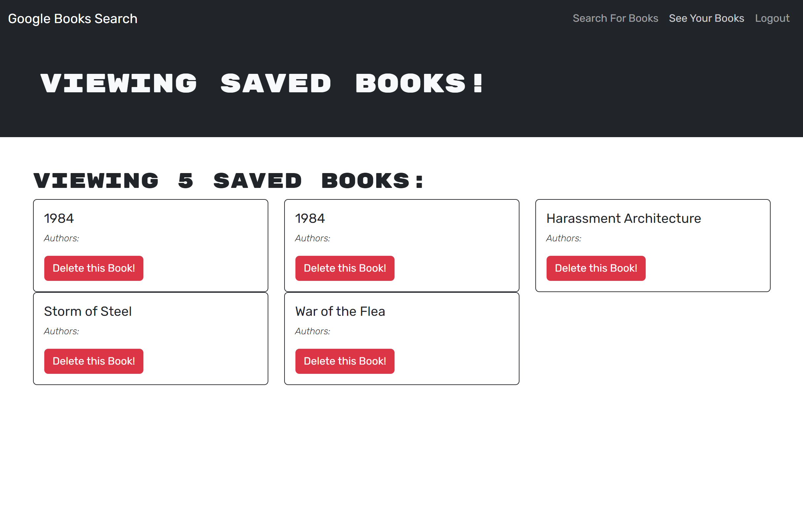

# Book Search Engine Refactor

## Description

To test my knowledge with the newest API technology I refactored a common RESTful API website into a GraphQL/Apollo website, functionality through the site was maintained but allowing for a much efficient and futureproof API

## Table of Contents

- [Installation](#installation)
- [Usage](#usage)
- [Questions](#questions)
- [Deployment](#deployment)
- [License](#license)

## Installation

npm i should take care of all needed installations

## Usage

Upon loading you'll be presented with the search page, you can search for books here, if you are not logged in the page offers no further functionality. 

If you click the login/signup  button on the top right corner  you'll see the login page and an option to signup.

After you'll be taken to your profile page. Here you can see and delete your saved books. 

And now the search page also allows you to save your searches in your account

## Tests

No test provided

## Questions

For questions contact me at [Github](https://github.com/venecoderr) or [Email me](mailto:josefrm.55@gmail.com)

## Deployment

https://ser-search-engine-refactoring.onrender.com/

## License

This project is under the Unlicense license

